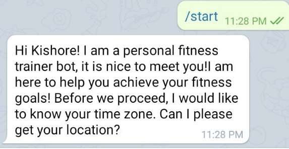
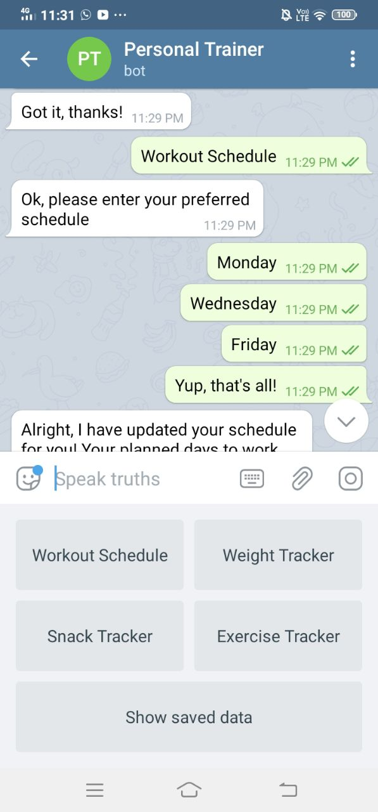

Personal Trainer Bot

This is a simple telegram bot to help users keep track of their weight, snacking habits and workouts.

Below is a screenshot when starting the bot:

Below is a screenshot of the bot tracking weight:

To install this bot, simple clone this script into your local machine and run update the bot's token under __main__.py.
To run the script, just navigate to project directory and run
python3 -m sample

All the data is stored the file named userdata. (Note, not to be confused with UserData.py)
To run the script, simply navigate run:
$~ python3 -m sample

This script was compiled with python3.

